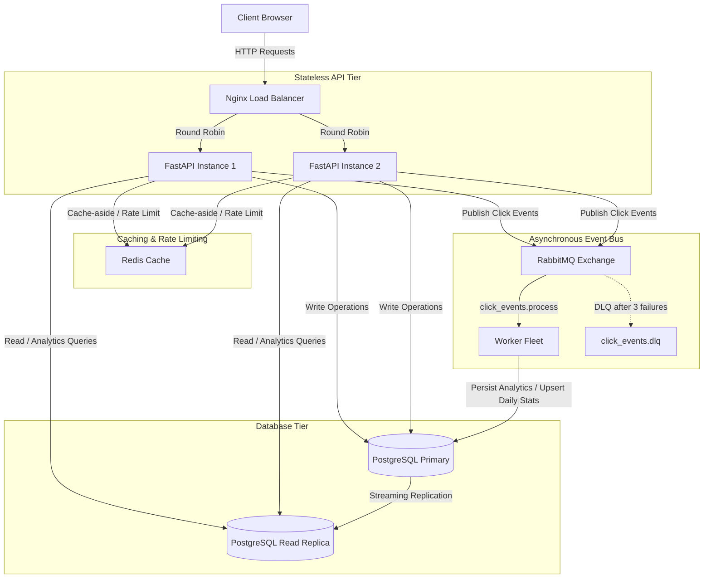

# CacheFlow

CacheFlow is a production-grade URL shortener and link infrastructure designed to demonstrate core backend scalability and system design patterns. The project implements cache-aside reads, rate limiting, event-driven analytics, asynchronous workers with error handling, and database streaming replication.

Every core architectural mechanism is observable through a live Architecture Dashboard that reports cache hit ratios, RabbitMQ queue depths, database connection pool utilization, and worker fleet heartbeats.

---

## Architecture Overview



---

## Architectural Decisions and Implementation Details

### 1. High-Performance Redirect Path (Cache-Aside Pattern)
The redirect path (`GET /{code}`) is the highest-traffic flow in any shortener. In CacheFlow, reads are decoupled from database queries:
* **The Flow**: The application checks Redis for the mapping. On a cache hit, the client is redirected immediately (sub-millisecond latency). On a cache miss, the service queries the database, updates the cache, and performs the redirect.
* **Write-Through Population**: When a URL is created, the cache is populated immediately to ensure the first redirect is a hit.
* **Cache Invalidation**: On URL updates or deletions, the corresponding cache keys are explicitly invalidated to prevent stale reads.

### 2. Collision-Free Short Code Generation with Obfuscation
* **Uniqueness Guarantee**: To generate unique 7-character Base62 short codes without collision checks, CacheFlow utilizes a PostgreSQL sequence. Upon URL creation, the sequence ID is fetched, ensuring guaranteed uniqueness.
* **ID Obfuscation (Feistel Cipher)**: Directly encoding sequential database IDs makes URLs predictable and guessable. To secure links, the sequence ID is permuted using a custom bijective 64-bit Feistel cipher before Base62 encoding. This generates randomized-looking short codes (e.g., `cATKcAIhgid`) while preserving a 1-to-1 mapping with no database collision lookup loops.

### 3. Asynchronous Analytics Pipeline
To prevent analytics logging from delaying redirects, the tracking pipeline is decoupled:
* **Fire-and-Forget Publishing**: The redirect endpoint publishes a structured payload containing referrer and device information to a RabbitMQ exchange, returning the `302 Found` redirect immediately.
* **Competing Consumers**: A scalable fleet of python workers consumes from the `click_events.process` queue. Workers write raw event logs, upsert daily stats aggregates (`url_daily_stats`), and increment the denormalized total click count on the URL record.
* **Retry and Dead-Lettering (DLQ)**: If a database transaction fails due to transient locks or connection drops, the worker schedules a retry with exponential backoff. If processing fails three times, the message is dead-lettered to `click_events.dlq` for operator inspection.

### 4. Database Scaling via Streaming Replication
* **Primary and Replica Separation**: The database tier consists of a primary database (`postgres`) and a standby replica (`postgres_replica`).
* **Streaming Replication**: The replica initializes from the primary via `pg_basebackup` and runs in hot-standby mode, streaming WAL logs from the primary.
* **SQLAlchemy Routing**: The API uses dual session makers. Write operations (such as URL creation and worker analytics writes) are routed to the primary, while read-only requests (dashboard queries, user lookup, and redirect misses) are routed to the read replica.

### 5. Distributed Rate Limiting
* **Sliding Window Algorithm**: Rate limits are enforced on URL creation and redirect endpoints using a Redis sorted set (`ZSET`) algorithm. This prevents boundary-burst issues common in fixed-window rate limiters.
* **Lua Scripting**: To ensure thread safety and low latency, checking the limit and adding the request timestamp is executed as an atomic Redis Lua script in a single network round-trip.

---

## Technology Stack

* **Frontend**: React 18, TypeScript, Tailwind CSS, Recharts
* **Backend**: FastAPI, SQLAlchemy (asyncpg), Pydantic v2
* **Databases**: PostgreSQL 16 (Primary + Streaming Replica), Redis 7
* **Message Broker**: RabbitMQ 3.12 (Durable queues, topic exchanges, DLQ)
* **Observability**: Structlog (Structured JSON logs), OpenTelemetry (fastapi, sqlalchemy, redis instrumentation), Prometheus, Grafana
* **Load Balancer**: Nginx (configured for round-robin load distribution across multiple backend replicas)

---

## Directory Structure

```
cacheflow/
├── backend/
│   ├── app/
│   │   ├── api/v1/        # FastAPI endpoints (auth, urls, analytics, metrics)
│   │   ├── core/          # Configuration, security, middleware, RabbitMQ declaration
│   │   ├── db/            # Database session and Redis client initialization
│   │   ├── models/        # SQLAlchemy database models
│   │   ├── repositories/  # Database access layer
│   │   ├── schemas/       # Pydantic request/response models
│   │   ├── services/      # Business logic services
│   │   ├── utils/         # Base62 encoding and Feistel cipher implementation
│   │   └── workers/       # Asynchronous consumer workers
│   ├── Dockerfile
│   └── Requirements.txt
├── frontend/
│   ├── src/               # React application and Architecture Dashboard UI
│   └── Dockerfile
├── nginx/                 # Nginx load balancer configurations
├── init-db/               # Primary database schema initialization scripts
├── init-replica/          # Replica database setup entrypoints
└── docker-compose.yml
```

---

## Quickstart

### Local Development
1. Copy the template environment variables:
   ```bash
   cp .env.example .env
   ```
2. Build and start the entire container stack:
   ```bash
   docker compose up --build -d
   ```
3. Access the local services:
   * **Frontend Application**: `http://localhost:3000`
   * **API Load Balancer / Swagger Docs**: `http://localhost:8080/docs`
   * **RabbitMQ Management Console**: `http://localhost:15672` (User/Password: `cacheflow`/`cacheflow`)
   * **Grafana Metrics Dashboard**: `http://localhost:3001` (User/Password: `admin`/`cacheflow`)

4. Scale the workers to demonstrate horizontal scaling:
   ```bash
   docker compose up -d --scale worker=4
   ```

---

## Production VPS Deployment (AWS EC2 / Always-Free VPS)

To deploy the entire multi-container stack to a clean Ubuntu VPS:

1. **Clone the repository**:
   ```bash
   git clone https://github.com/KeshavSwami04/CacheFlow.git
   cd CacheFlow
   ```

2. **Automated Provisioning**:
   Run the included setup script to configure 2GB swap space (essential for 1GB RAM instances to prevent OOM errors) and install Docker:
   ```bash
   chmod +x scripts/vps_setup.sh
   ./scripts/vps_setup.sh
   ```

3. **Reboot the VPS**:
   Reboot to apply Docker group permissions and auto-expand drive space if you modified the EBS volume size:
   ```bash
   sudo reboot
   ```

4. **Start the Stack**:
   SSH back into the server, enter the project directory, copy the environment file, and start:
   ```bash
   cd CacheFlow
   cp .env.example .env
   docker compose up --build -d
   ```
