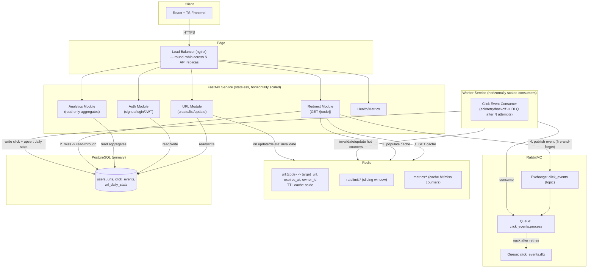
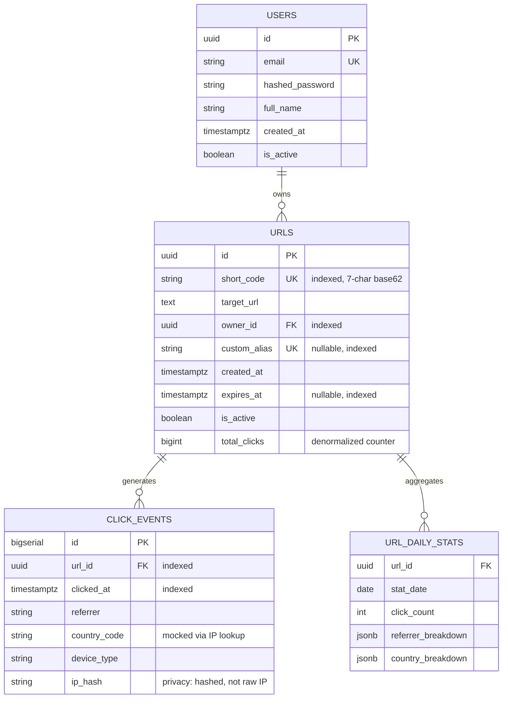
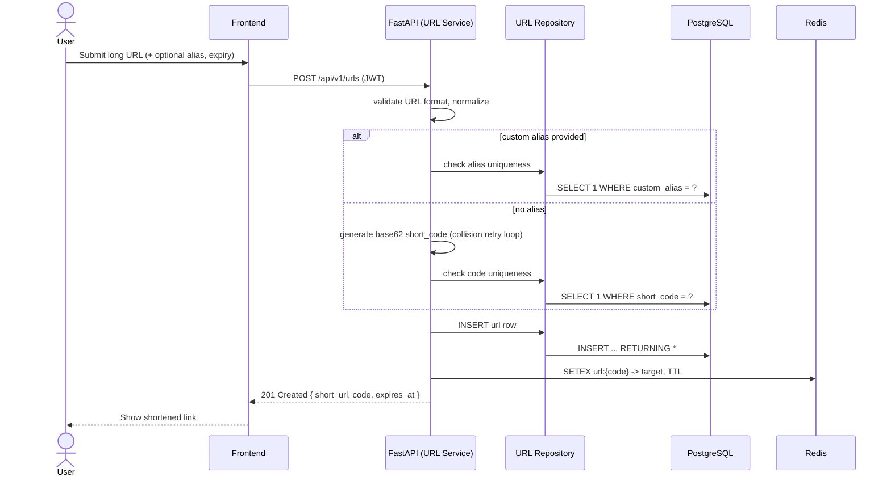
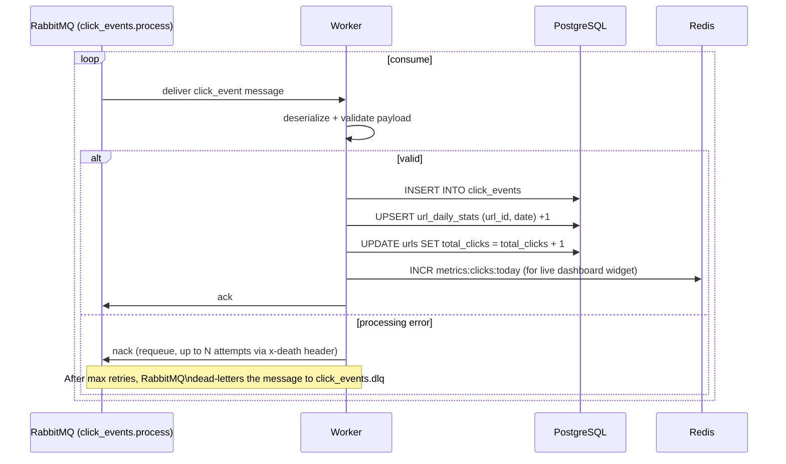
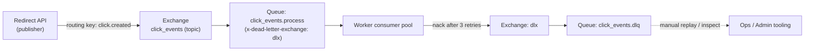
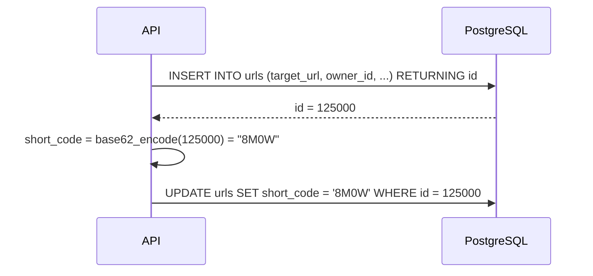

# CacheFlow — Architecture Design (Draft for Review)

CacheFlow is a URL shortener built to demonstrate production system-design
patterns: cache-aside reads, event-driven analytics, async workers with
retry/DLQ, and a horizontally-scalable stateless API tier.

---

## 1. High-Level System Architecture



**Key idea:** the redirect path never blocks on analytics. It does a cache
lookup, optionally a DB read-through, and *publishes* a click event to
RabbitMQ asynchronously. A separate worker pool consumes and persists
analytics. This decouples "serve the redirect fast" from "record the click,"
which is the actual interview-relevant design decision in a URL shortener.

---

## 2. Database Schema



**Indexing decisions:**
- `urls.short_code` — unique B-tree index; this is the hot lookup path for every redirect (cache miss only).
- `urls.owner_id` — index for dashboard "my URLs" pagination.
- `urls.expires_at` — partial index `WHERE expires_at IS NOT NULL` for the expiry-sweep job.
- `click_events.url_id, clicked_at` — composite index for analytics time-range queries.
- `url_daily_stats` — composite PK `(url_id, stat_date)`; pre-aggregated so the dashboard's "daily clicks" chart doesn't scan raw `click_events`.

---

## 3. Sequence Diagram — URL Creation



---

## 4. Sequence Diagram — Redirect Flow (cache-aside)

```mermaid
sequenceDiagram
    actor Visitor
    participant API as FastAPI (Redirect Service)
    participant Cache as Redis
    participant PG as PostgreSQL
    participant MQ as RabbitMQ

    Visitor->>API: GET /{short_code}
    API->>Cache: GET url:{short_code}
    alt cache hit
        Cache-->>API: target_url, expires_at
    else cache miss
        API->>PG: SELECT * FROM urls WHERE short_code = ?
        PG-->>API: row
        API->>Cache: SETEX url:{code} TTL=3600
    end
    API->>API: check expiry / is_active
    API-->>Visitor: 302 Redirect to target_url
    par fire-and-forget
        API->>MQ: publish click_event {url_id, ts, referrer, ua, ip_hash}
    end
    Note over API,MQ: Publish is non-blocking; redirect already returned.\nIf MQ is briefly unavailable, the redirect still succeeds\n(analytics is best-effort, not on the critical path).
```

---

## 5. Sequence Diagram — Analytics Pipeline (async worker)



---

## 6. Caching Strategy (Redis)

| Key pattern | Purpose | TTL | Invalidation |
|---|---|---|---|
| `url:{short_code}` | Cache-aside for redirect target | 1h sliding | On URL update/delete; on expiry write-through |
| `ratelimit:{user_id\|ip}:{window}` | Sliding-window rate limiting on create/redirect | 60s | Auto-expire |
| `metrics:cache:hits` / `metrics:cache:misses` | Live cache hit-ratio for Architecture page | none (counter) | Never (reset on deploy) |
| `metrics:clicks:today` | Live click counter widget | 24h | Daily rollover |
| `session:blacklist:{jti}` | JWT revocation list (logout) | matches token TTL | Auto-expire |

**Pattern used:** cache-aside (lazy loading) for reads, explicit invalidation
on writes. Chosen over write-through because URL reads vastly outnumber
writes (typical shortener access pattern), so we only pay the cache-population
cost for codes that are actually requested.

---

## 7. RabbitMQ Topology



- Durable exchange + queue, persistent messages → survive broker restart.
- Per-message retry count tracked via header; after 3 failed attempts the
  message is routed to the DLQ instead of looping forever (poison-message
  protection).
- Multiple worker replicas can consume from the same queue (competing
  consumers) for horizontal scaling.

---

## 8. Scalability Notes (for review)

- **API tier is stateless** — JWT auth means no server-side session; any
  replica can serve any request. Horizontal scaling = add replicas behind
  the load balancer.
- **Redirect is the hottest path** — optimized to be cache-only in the common
  case (no DB hit, no synchronous MQ wait).
- **Workers scale independently of the API** — under click-traffic spikes,
  scale worker replicas without touching the API tier.
- **Postgres** is the eventual bottleneck at extreme scale; documented
  follow-ups (read replicas, partitioning `click_events` by month) are
  covered in the final System Design Decisions doc rather than implemented,
  to keep scope realistic for a portfolio project.

---

## 9. Decisions (approved)

### 9.1 Short code generation — Base62(sequence_id)

Instead of random base62 + collision retry, `urls.id` is a `BIGSERIAL`
(backed by a PostgreSQL sequence). On insert we get the new `id` back via
`RETURNING id`, then encode it as base62 to produce `short_code`. This is
the scheme real-world shorteners (and most "design a URL shortener"
interview answers) converge on:

- **No collisions, ever** — the sequence guarantees uniqueness, so there's
  no retry loop and no uniqueness check on write.
- **Monotonically increasing** → predictable code length growth (5-6 chars
  comfortably covers billions of URLs), and codes are naturally sortable
  by creation order if ever needed for debugging.
- **Tradeoff**: codes are guessable/enumerable (sequential). For a portfolio
  shortener this is an acceptable, explicitly documented tradeoff — a
  production system handling sensitive links would add a permutation step
  (e.g., Feistel cipher over the ID space) to de-correlate code from
  sequence. This is called out in `System Design Decisions`.
- Custom aliases bypass the sequence entirely and are stored/checked as
  before (uniqueness constraint on `custom_alias`).


*(Two statements, one transaction — see backend `URLRepository.create()`.)*

### 9.2 Rate limiting — sliding window, on both create and redirect

Implemented in Redis using a sorted-set sliding-window algorithm (`ZADD` +
`ZREMRANGEBYSCORE` + `ZCARD` inside a Lua script for atomicity):

| Endpoint | Key | Limit |
|---|---|---|
| `POST /api/v1/urls` | `ratelimit:create:{user_id}` | 30 req / 60s |
| `GET /{short_code}` | `ratelimit:redirect:{ip_hash}` | 100 req / 60s |

Sliding window (vs. fixed window) avoids the boundary burst problem (2x
limit at window edges) while staying O(log N) per request and not requiring
a background sweep.

### 9.3 Architecture Dashboard — live system metrics

A dedicated `/api/v1/architecture/metrics` endpoint (and frontend page)
exposes, polled every few seconds:

- **Cache hit rate / miss rate** — from `metrics:cache:hits` / `metrics:cache:misses` Redis counters
- **Queue depth** — RabbitMQ Management HTTP API (`/api/queues/.../click_events.process`) → `messages` count
- **Worker status** — workers heartbeat into Redis (`worker:heartbeat:{worker_id}` with short TTL); endpoint reports workers seen in the last 15s as "alive"
- **Processed events count** — Redis counter `metrics:events:processed`, incremented by the worker on each successful ack
- **DLQ count** — RabbitMQ Management API queue depth for `click_events.dlq`

This is the "resume-worthy" page: it's a real systems-observability view,
not a static screenshot.

### 9.4 OpenTelemetry tracing

`opentelemetry-instrumentation-fastapi`, `-sqlalchemy`, `-redis`, and
`-pika` auto-instrument the API and worker. A request-scoped trace ID is
also injected into structured logs (so logs and traces correlate even
without a collector running). Exporter defaults to console/OTLP-stdout in
dev; an OTLP exporter to a collector (e.g., Jaeger/Tempo) is wired behind an
env var (`OTEL_EXPORTER_OTLP_ENDPOINT`) for production, documented in
`DEPLOYMENT.md`.

### 9.5 Geo analytics — kept mocked

Small static IP-prefix → country-code lookup table used at click-event
processing time. Documented as a stand-in for a real MaxMind GeoIP2
database in `System Design Decisions`.

### 9.6 Future scaling: PostgreSQL read replicas

Documented (not implemented) in `System Design Decisions` / `ARCHITECTURE.md`
final version: analytics reads (`/api/v1/analytics/*`) and dashboard list
queries are read-heavy and tolerate slight staleness, making them good
candidates to route to one or more read replicas via SQLAlchemy's
`Session` routing (writes → primary, reads → replica pool), once query
volume justifies the operational cost.

---

*This document reflects the approved architecture. Proceeding to Step 3:
Backend Foundation Generation.*
